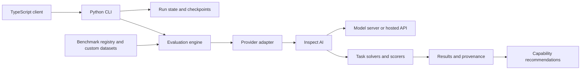

<div align="center">

# matric-eval

**Reproducible model evaluation across local and hosted inference providers**

Compare model capabilities, retain benchmark protocols and run artifacts, and generate recommendations for the matric ecosystem.

[](https://github.com/jmagly/matric-eval/blob/main/pyproject.toml)
[](https://github.com/jmagly/matric-eval/blob/main/LICENSE)
[](#inference-providers)

[**Quick Start**](#quick-start) · [**Features**](#features) · [**Documentation**](#documentation) · [**Contributing**](#contributing) · [**Support**](#community--support)

</div>

---

## What matric-eval Does

matric-eval is a Python CLI and library built on Inspect AI. It runs public benchmarks and application-specific tasks through a shared provider interface, records results and provenance, and recommends models by capability. The TypeScript client invokes the same Python CLI for application integration.

Use it to compare code generation, math, reasoning, instruction following, knowledge, conversation, tool use, and application behavior. Agentic, multimodal, repository, long-context, and memory adapters have individual data and runtime prerequisites; a registry entry does not mean a benchmark can run without setup.

## Status

The Python package and TypeScript client source versions are **2026.9.0**, using CalVer `YYYY.M.PATCH`. Check [GitHub Releases](https://github.com/jmagly/matric-eval/releases) or [Gitea Releases](https://git.integrolabs.net/roctinam/matric-eval/releases) for published artifacts and their validation evidence. Package registry publishing is disabled; a source version alone does not establish release availability.

The [roadmap](https://github.com/jmagly/matric-eval/blob/main/docs/development/roadmap.md) records support boundaries and deferred work. Benchmark inventories change independently of release notes; inspect the current checkout with `matric-eval list-benchmarks` and `matric-eval audit-benchmarks`.

## Installation

### From source

Install Python 3.11 or newer and `uv`, then:

```bash
git clone https://git.integrolabs.net/roctinam/matric-eval.git
cd matric-eval
uv sync --locked
uv run matric-eval --version
uv run matric-eval --help
```

The canonical Gitea repository may require access. The [GitHub repository](https://github.com/jmagly/matric-eval) is the secondary source remote.

Use `uv run matric-eval` for commands from a source checkout. Examples below use that form. With an installed package, use `matric-eval` directly.

### From verified release downloads

Download and verify the desired bundle from GitHub or Gitea Releases as described in the [release guide](docs/development/releasing.md), then install its wheel into a virtual environment:

```bash
python3 -m venv .venv
. .venv/bin/activate
python -m pip install ./packages/python/matric_eval-2026.9.0-py3-none-any.whl
matric-eval --version
```

Release downloads, checksums, and package validation are described in the [release notes](https://github.com/jmagly/matric-eval/blob/main/docs/releases/2026.9.0.md). Optional source extras include `dev`, `study`, `ds1000`, and `evalplus`; install only those needed by your workflow, for example `uv sync --locked --extra dev --extra study`.

## Quick Start

For a first run, use an existing Ollama server with `llama3.2:3b` installed. Select one benchmark explicitly to keep the run bounded:

```bash
# Inspect the local model inventory and available benchmarks
uv run matric-eval list-models
uv run matric-eval list-benchmarks

# Evaluate five GSM8K samples through the default Ollama path
uv run matric-eval run --model llama3.2:3b --benchmark gsm8k --tier smoke
```

The run prints its result directory, normally `results/run-<timestamp>`. Use the actual directory and run ID from that output:

```bash
uv run matric-eval recommend --results-dir results/RUN_ID
uv run matric-eval validate RUN_ID --output results

# Resume an incomplete run at benchmark granularity
uv run matric-eval run --resume results/RUN_ID --fill-gaps
```

Without `--model`, the default Ollama path discovers models under `--max-size` (15 GB by default). Without `--benchmark`, the CLI selects the benchmarks enabled by the named tier configuration. This can be much broader than a single smoke check.

## Features

- **Five inference providers:** Ollama, llama.cpp, vLLM, OpenRouter, and Chutes.
- **Benchmark protocols:** lifecycle state, dataset and evaluator revisions, access requirements, and freshness audits.
- **Model comparisons:** YAML matrices with Cartesian or explicit runs; schema version 2 adds qualified model identity and lineage checks.
- **Checkpoint and resume:** persisted run state, locking, completed-result reuse, and continuation of incomplete benchmarks.
- **Thinking and judges:** reasoning modes for capable models and optional additional LLM judge scoring.
- **Application integration:** matric-cli and matric-memory tasks, capability recommendations, and a TypeScript subprocess client.
- **Custom data:** discover JSONL datasets with optional field mapping, prompts, scorers, and tier configuration.
- **Preregistered studies:** protocol validation, deterministic sample manifests, model artifact qualification, and manifest-locked offline execution.

## Inference Providers

| Provider | CLI name | Default endpoint / setup |
|---|---|---|
| Ollama | `ollama` | `http://localhost:11434`; installed model required |
| llama.cpp | `llama-cpp` | `http://localhost:8080`; running model server required |
| vLLM | `vllm` | `http://localhost:8000`; served model ID required |
| OpenRouter | `openrouter` | Hosted API; authenticated account and model access required |
| Chutes | `chutes` | Hosted API; authenticated account and model access required |

```bash
uv run matric-eval list-providers --check-availability
uv run matric-eval run --provider vllm --provider-url http://localhost:8000 \
  --model YOUR_SERVED_MODEL_ID --benchmark gsm8k --tier smoke
uv run matric-eval run --provider openrouter --api-key "$OPENROUTER_API_KEY" \
  --model YOUR_OPENROUTER_MODEL_ID --benchmark gsm8k --tier smoke
```

Replace the model placeholders with identifiers served by your provider. Set the credential variable locally before the hosted-provider example. Explicit CLI runs accept `--api-key`; provider instances created with their default configuration, including matrix providers, read `OPENROUTER_API_KEY` or `CHUTES_API_KEY` from the environment.

A working provider health check does not prove benchmark data, tools, or scoring prerequisites are satisfied. Retained real-provider validation is documented in the [smoke guide](https://github.com/jmagly/matric-eval/blob/main/docs/testing/real-provider-smoke.md).

## Benchmarks and Tiers

```bash
uv run matric-eval list-benchmarks --output-format json
uv run matric-eval audit-benchmarks --fail-on-error
```

| Lifecycle | Meaning |
|---|---|
| `stable` | Supported adapter with a pinned protocol; still check task prerequisites |
| `legacy` | Retained compatibility protocol when a successor exists |
| `gated` | Requires documented data, runner, hardware, credentials, or licensing prerequisites |
| `experimental` | Research integration whose execution or scoring contract may change |
| `unavailable` | Explicitly retained no-go entry; not runnable |

Core tasks include HumanEval, MBPP, GSM8K, ARC, IFEval, LiveCodeBench, DS-1000, MMLU, MT-Bench, Tool Calling, matric-cli, and matric-memory. Successor and specialist adapters are described in the [benchmark protocol index](https://github.com/jmagly/matric-eval/blob/main/docs/README.md#benchmark-protocols). Use exact registry names, such as `tool_calling` and `matric_memory`, with `--benchmark`.

| Tier | Selection |
|---|---|
| `smoke` | Small per-benchmark sample; GSM8K uses 5 |
| `quick` | Larger per-benchmark sample; GSM8K uses 75 |
| `full` | Full configured protocol count or all available samples, depending on the task |

Tier sizes vary by benchmark. External JSONL datasets default to 10 smoke samples, 50 quick samples, and all samples for full. A full tier does not remove access gates or runtime requirements.

## Evaluation Matrix

Save this as `eval-matrix.yaml`, substituting the actual model IDs available from each server:

```yaml
evaluation:
  tier: smoke
  matrix:
    mode: explicit
  runs:
    - model: llama3.2:3b
      provider: ollama
      benchmark: gsm8k
    - model: YOUR_SERVED_MODEL_ID
      provider: vllm
      benchmark: gsm8k
```

```bash
uv run matric-eval run --matrix eval-matrix.yaml
```

For Cartesian matrices, set `models`, `providers`, and `benchmarks` arrays, with `matrix.mode: cartesian`; optional `exclude` entries remove combinations. Matrix execution uses its own provider setup and cannot be combined with `--resume`. See [qualified model examples](https://github.com/jmagly/matric-eval/blob/main/examples/README.md) for schema version 2 and external-runner boundaries.

## Custom Datasets

Create a directory such as `datasets/my-eval/` containing `samples.jsonl`:

```jsonl
{"id":"addition-1","input":"What is 2 + 2? Answer with a number.","target":"4"}
```

```bash
uv run matric-eval list-benchmarks
uv run matric-eval run --benchmark my-eval --model llama3.2:3b --tier smoke
```

Discovery supports JSONL inputs in dataset directories, including checked-out repositories and submodules. It does not turn arbitrary repository contents into executable benchmarks. To customize the dataset, add `datasets/my-eval/dataset.yaml`:

```yaml
name: my-eval
description: Domain-specific evaluation
scorer: match
tiers: { smoke: 5, quick: 50, full: 0 }
field_mapping: { input: question, target: answer }
```

That mapping expects `question` and `answer` fields instead of the example's `input` and `target`. Configure another root with `EVAL_DATASETS_DIR=/path/to/datasets`.

## Preregistered Studies

Study protocols define model cohorts, sampling, execution, and reporting contracts. The CLI provides four study commands:

| Command | Purpose |
|---|---|
| `validate-study` | Validate a study protocol and report its identity and allocations |
| `build-study-manifest` | Select ordered canonical sample IDs for a pilot or full cohort |
| `qualify-study-model` | Hash local model artifacts and create a qualification manifest |
| `run-study-offline-batch` | Execute a qualified, manifest-locked cohort with offline vLLM |

Follow the [study index](https://github.com/jmagly/matric-eval/blob/main/studies/README.md) and the chosen protocol's host and artifact policy. Protocol validation is separate from actually running the model or completing a study.

## TypeScript Client

The client requires Node.js 18 or newer and a separately installed Python `matric-eval` executable. Install the verified tarball from a GitHub or Gitea release bundle:

```bash
npm install ./packages/typescript/matric-eval-client-2026.9.0.tgz
```

```typescript
import { createClient } from '@matric/eval-client';

const client = createClient(); // matric-eval must be on PATH
const summary = await client.run({
  tier: 'smoke',
  models: ['llama3.2:3b'],
  benchmarks: ['gsm8k'],
});
const recommendations = await client.recommend({ input: summary.outputDir });
```

Use `createClient('/absolute/path/to/.venv/bin/matric-eval')` for a source installation. The client supports streaming callbacks and cancellation with `AbortSignal`. The current CLI contract rejects multiple explicit models in one client call, `resume: true`, and the reserved `timeout` and `parallelism` options. Use one model per call or the CLI matrix workflow. See the [client source and types](https://github.com/jmagly/matric-eval/tree/main/bindings/typescript/src).

## Architecture



The normal CLI run retains benchmark-level state and result artifacts. Matrices and specialized study runners have separate execution paths. Some agentic benchmarks delegate to pinned external runtimes rather than the generic Inspect task path. The [architecture guide](https://github.com/jmagly/matric-eval/blob/main/docs/architecture/overview.md) maps those boundaries to source files.

## Execution Safety

Code benchmarks execute model-generated programs. The basic Python scorer uses a subprocess with a timeout; it does **not** enforce network denial, filesystem isolation, or memory limits. Run untrusted workloads inside appropriately configured containers or VMs, and follow each benchmark's runtime requirements. Ollama serves inference; it does not sandbox code executed by the evaluator. See the [security policy](https://github.com/jmagly/matric-eval/blob/main/SECURITY.md).

## Troubleshooting

| Symptom | Next step |
|---|---|
| `matric-eval` not found | In a source checkout, run `uv sync --locked` and use `uv run matric-eval` |
| No Ollama models / connection failure | Check the server, install the chosen model, and run `list-models` |
| Hosted provider authentication fails | Verify the explicit run's `--api-key` or the matrix provider's environment variable |
| Benchmark is gated or unavailable | Read its reason in `list-benchmarks` and follow its protocol record |
| Dataset is not discovered | Check `EVAL_DATASETS_DIR`, JSONL records, and `dataset.yaml` field mapping |
| Interrupted evaluation | Run `validate RUN_ID --output results`, then `run --resume results/RUN_ID` |
| Stale run lock | Confirm no evaluator is active before using `validate RUN_ID --force-unlock` |
| Matrix resume rejected | `--matrix` and `--resume` cannot be used together |

## Documentation

- [Documentation index](https://github.com/jmagly/matric-eval/blob/main/docs/README.md)
- [CLI reference](https://github.com/jmagly/matric-eval/blob/main/docs/cli.md)
- [Architecture](https://github.com/jmagly/matric-eval/blob/main/docs/architecture/overview.md)
- [Checkpoint and resume](https://github.com/jmagly/matric-eval/blob/main/docs/development/checkpoint-resume.md)
- [Benchmark protocols](https://github.com/jmagly/matric-eval/blob/main/docs/README.md#benchmark-protocols)
- [Agentic runner setup](https://github.com/jmagly/matric-eval/blob/main/docs/benchmarks/agentic-runners.md)
- [Roadmap](https://github.com/jmagly/matric-eval/blob/main/docs/development/roadmap.md)
- [Testing guide](https://github.com/jmagly/matric-eval/blob/main/docs/testing/contributing.md)
- [Workspace guidance](https://github.com/jmagly/matric-eval/blob/main/WORKSPACE.md)

## Contributing

Read [CONTRIBUTING.md](https://github.com/jmagly/matric-eval/blob/main/CONTRIBUTING.md). From a source checkout:

```bash
uv sync --locked --extra dev --extra study
make ci
uv build
```

`make ci` runs lint, format, the mypy baseline ratchet, and tests with an 80% coverage gate. Package build and real-provider smoke evidence have separate workflows. For TypeScript changes, run `npm ci`, `npm run build`, and `npm test` in `bindings/typescript/`.

## Community & Support

- **Engineering issues and pull requests:** [Gitea tracker](https://git.integrolabs.net/roctinam/matric-eval/issues)
- **Source mirror:** [GitHub](https://github.com/jmagly/matric-eval)
- **Release artifacts:** [GitHub Releases](https://github.com/jmagly/matric-eval/releases), [Gitea Releases](https://git.integrolabs.net/roctinam/matric-eval/releases)
- **Vulnerabilities:** Follow [SECURITY.md](https://github.com/jmagly/matric-eval/blob/main/SECURITY.md); avoid public disclosure of sensitive details.
- **Integro Labs:** [integrolabs.io](https://integrolabs.io)

## License

MIT. See [LICENSE](https://github.com/jmagly/matric-eval/blob/main/LICENSE). Benchmark datasets, model weights, and external runners retain their own terms and access conditions.

## Acknowledgments

Built on Inspect AI and the benchmark authors' datasets and evaluation protocols. The matric-cli and matric-memory projects supply the application-specific evaluation use cases.

---

<div align="center">

[**Back to Top**](#matric-eval) · [**Integro Labs**](https://integrolabs.io)

</div>
