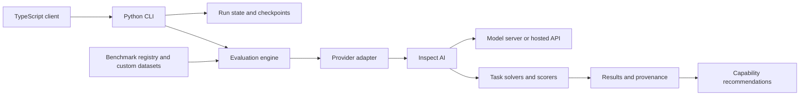

<div align="center">


# matric-eval

**Reproducible model evaluation across local and hosted inference providers**

Run a first smoke test, compare local and hosted models, and carry the results into application decisions.
matric-eval brings benchmark protocols, provider adapters, resumable runs, and versioned measurements
together in a Python CLI, with a TypeScript client for application integration.

[](pyproject.toml)
[](LICENSE)
[](#inference-providers)

[**Quick Start**](#quick-start) · [**Workflows**](#choose-your-workflow) · [**Features**](#features) · [**Results**](#results-and-comparisons) · [**Documentation**](#documentation) · [**Contributing**](#contributing) · [**Support**](#community--support)

</div>

---

## What matric-eval Does

matric-eval is a Python CLI and library built on Inspect AI. It runs public benchmarks and application-specific tasks through a shared provider interface, records results and provenance, and recommends models by capability. The TypeScript client invokes the same Python CLI for application integration.

Use it to compare code generation, math, reasoning, instruction following, knowledge, conversation, tool use, and application behavior. Agentic, multimodal, repository, long-context, and memory adapters have individual data and runtime prerequisites; a registry entry does not mean a benchmark can run without setup.

## Who It’s For

matric-eval is useful when you need to choose a model for a particular workload and keep a reviewable account
of how you made that choice. Start with a single benchmark and provider, then add the protocols and execution
controls your comparison needs.

| Your work | What matric-eval provides | Start here |
|---|---|---|
| Building an application | Public and application-specific tasks, custom JSONL data, a TypeScript client | [Quick Start](#quick-start) |
| Comparing inference backends | Five provider adapters and explicit or Cartesian evaluation matrices | [Evaluation Matrix](#evaluation-matrix) |
| Maintaining a model evaluation history | Versioned measurements, strict readers, immutable trend imports | [Results and Comparisons](#results-and-comparisons) |
| Running a controlled study | Protocol validation, deterministic manifests, artifact qualification | [Preregistered Studies](#preregistered-studies) |
| Evaluating an agent platform | Pinned scenarios, bounded execution, separate quality and infrastructure outcomes | [Agentic Evaluation Pipelines](#agentic-evaluation-pipelines) |

## What Problems Does It Solve?

### Comparing models under explicit conditions

A model name and a score leave out much of an experiment: the dataset revision, sample selection, prompt,
scorer, reasoning settings, and runtime can all affect the result. matric-eval connects benchmark protocol
records to execution and result artifacts so those conditions can be inspected. Matrices make the intended
model/provider/benchmark combinations explicit; qualified model declarations add identity and lineage checks.

That structure gives you a basis for comparison. The result contract and recommendation policy still need to
establish that the measurements are eligible to be compared before a ranking is meaningful.

### Carrying evaluation work across interruptions

A long evaluation can stop after some benchmarks have finished. The standard CLI records run state, locks,
and completed results, then supports resuming at benchmark granularity. You can validate the retained run,
inspect gaps, and continue without manually rebuilding its model and benchmark selection.

Matrices and specialized runners have their own execution contracts. Follow the recovery path for the runner
that produced the artifacts; a standard run checkpoint does not cover every workflow.

### Keeping useful measurements when a single score is insufficient

An evaluation can produce several named metrics, missing estimates, failed attempts, and excluded results.
Version 2 output preserves those distinctions alongside declared comparison scope. Strict readers and trend
imports let downstream applications retain the richer record, while capability policies define how eligible
measurements contribute to a decision.

This is particularly useful when a provider failure, incomplete suite, or changed judge would otherwise be
mistaken for a change in model quality.

## Simple Building Blocks

| Building block | Role in an evaluation |
|---|---|
| **Benchmark** | Connects samples, task behavior, scoring, lifecycle, and protocol metadata |
| **Provider** | Connects an inference backend to the evaluation path |
| **Tier** | Selects a configured sample count for a bounded check or larger run |
| **Matrix** | Declares combinations of models, providers, and benchmarks |
| **Run and checkpoint** | Retains the standard CLI’s execution state and completed benchmark results |
| **Result contract** | Represents measurements, outcomes, missingness, and comparison eligibility |
| **Study protocol and manifest** | Freezes the study design and ordered sample selection before execution |

For example, a smoke run checks that a chosen model can complete five GSM8K samples. A matrix repeats the
selected protocol across declared targets. A study adds a frozen sampling and artifact contract. These are
successive choices about what you need to control, each with its own setup and retained outputs.

## Choose Your Workflow

1. **Get a first result:** install from source, connect an existing Ollama model, and run one smoke benchmark.
2. **Compare configured targets:** define an [evaluation matrix](#evaluation-matrix) and inspect the selected protocols.
3. **Test your application’s data:** add a [custom JSONL dataset](#custom-datasets) with an explicit scorer.
4. **Consume and compare measurements:** select [version 2 output](#results-and-comparisons), validate artifacts, and declare a capability policy.
5. **Control a larger experiment:** follow a [study protocol](#preregistered-studies) or [agentic pipeline](#agentic-evaluation-pipelines).

The Python package supplies evaluation orchestration. You supply model access and each task’s data and runtime
prerequisites. Start with a bounded run before committing to a broader tier or matrix.

## Status

The Python package and TypeScript client source versions are **2026.9.2**, using CalVer `YYYY.M.PATCH`. Check [GitHub Releases](https://github.com/jmagly/matric-eval/releases) or [Gitea Releases](https://git.integrolabs.net/roctinam/matric-eval/releases) for published artifacts and their validation evidence. Package registry publishing is disabled; a source version alone does not establish release availability.

The [roadmap](docs/development/roadmap.md) records support boundaries and deferred work. Benchmark inventories change independently of release notes; inspect the current checkout with `matric-eval list-benchmarks` and `matric-eval audit-benchmarks`.

## Installation

### From source

Install Python 3.11 or newer and `uv`, then:

```bash
git clone https://git.integrolabs.net/roctinam/matric-eval.git
cd matric-eval
uv sync --locked
uv run matric-eval --version
uv run matric-eval --help
```

The canonical Gitea repository may require access. The [GitHub repository](https://github.com/jmagly/matric-eval) is the secondary source remote.

Use `uv run matric-eval` for commands from a source checkout. Examples below use that form. With an installed package, use `matric-eval` directly.

### From verified release downloads

Download and verify the desired bundle from GitHub or Gitea Releases as described in the [release guide](docs/development/releasing.md), then install its wheel into a virtual environment:

```bash
python3 -m venv .venv
. .venv/bin/activate
python -m pip install ./packages/python/matric_eval-2026.9.2-py3-none-any.whl
matric-eval --version
```

Release downloads, checksums, and package validation are described in the [release notes](docs/releases/2026.9.2.md). Optional source extras include `dev`, `study`, `ds1000`, and `evalplus`; install only those needed by your workflow, for example `uv sync --locked --extra dev --extra study`.

## Quick Start

For a first run, use an existing Ollama server with `llama3.2:3b` installed. Select one benchmark explicitly to keep the run bounded:

```bash
# Inspect the local model inventory and available benchmarks
uv run matric-eval list-models
uv run matric-eval list-benchmarks

# Evaluate five GSM8K samples through the default Ollama path
uv run matric-eval run --model llama3.2:3b --benchmark gsm8k --tier smoke
```

The run prints its result directory, normally `results/run-<timestamp>`. Use the actual directory and run ID from that output:

```bash
uv run matric-eval validate RUN_ID --output results

# Resume an incomplete run at benchmark granularity
uv run matric-eval run --resume results/RUN_ID --fill-gaps
```

A completed smoke run verifies a small execution path; its sample size is not enough to establish a general
model ranking. For machine-readable measurements and policy-based recommendations, continue with
[Results and Comparisons](#results-and-comparisons).

Without `--model`, the default Ollama path discovers models under `--max-size` (15 GB by default). Without `--benchmark`, the CLI selects the benchmarks enabled by the named tier configuration. This can be much broader than a single smoke check.

## Features

- **Five inference providers:** Ollama, llama.cpp, vLLM, OpenRouter, and Chutes.
- **Benchmark protocols:** lifecycle state, dataset and evaluator revisions, access requirements, and freshness audits.
- **Model comparisons:** YAML matrices with Cartesian or explicit runs; schema version 2 adds qualified model identity and lineage checks.
- **Checkpoint and resume:** persisted run state, locking, completed-result reuse, and continuation of incomplete benchmarks.
- **Thinking and judges:** reasoning modes for capable models and optional additional LLM judge scoring.
- **Application integration:** matric-cli and matric-memory tasks, policy-based capability recommendations, and a TypeScript subprocess client.
- **Versioned measurements:** named metrics, nullable estimates, strict migration readers, and immutable history imports.
- **Agent platform pipelines:** registry-derived target coverage, pinned fixtures, execution budgets, and typed failure outcomes.
- **Custom data:** discover JSONL datasets with optional field mapping, prompts, scorers, and tier configuration.
- **Preregistered studies:** protocol validation, deterministic sample manifests, model artifact qualification, and manifest-locked offline execution.

## Inference Providers

| Provider | CLI name | Default endpoint / setup |
|---|---|---|
| Ollama | `ollama` | `http://localhost:11434`; installed model required |
| llama.cpp | `llama-cpp` | `http://localhost:8080`; running model server required |
| vLLM | `vllm` | `http://localhost:8000`; served model ID required |
| OpenRouter | `openrouter` | Hosted API; authenticated account and model access required |
| Chutes | `chutes` | Hosted API; authenticated account and model access required |

```bash
uv run matric-eval list-providers --check-availability
uv run matric-eval run --provider vllm --provider-url http://localhost:8000 \
  --model YOUR_SERVED_MODEL_ID --benchmark gsm8k --tier smoke
uv run matric-eval run --provider openrouter --api-key "$OPENROUTER_API_KEY" \
  --model YOUR_OPENROUTER_MODEL_ID --benchmark gsm8k --tier smoke
```

Replace the model placeholders with identifiers served by your provider. Set the credential variable locally before the hosted-provider example. Explicit CLI runs accept `--api-key`; provider instances created with their default configuration, including matrix providers, read `OPENROUTER_API_KEY` or `CHUTES_API_KEY` from the environment.

A working provider health check does not prove benchmark data, tools, or scoring prerequisites are satisfied. Retained real-provider validation is documented in the [smoke guide](docs/testing/real-provider-smoke.md).

## Benchmarks and Tiers

```bash
uv run matric-eval list-benchmarks --output-format json
uv run matric-eval audit-benchmarks --fail-on-error
```

| Lifecycle | Meaning |
|---|---|
| `stable` | Supported adapter with a pinned protocol; still check task prerequisites |
| `legacy` | Retained compatibility protocol when a successor exists |
| `gated` | Requires documented data, runner, hardware, credentials, or licensing prerequisites |
| `experimental` | Research integration whose execution or scoring contract may change |
| `unavailable` | Explicitly retained no-go entry; not runnable |

Core tasks include HumanEval, MBPP, GSM8K, ARC, IFEval, LiveCodeBench, DS-1000, MMLU, MT-Bench, Tool Calling, matric-cli, and matric-memory. Successor and specialist adapters are described in the [benchmark protocol index](docs/README.md#benchmark-protocols). Use exact registry names, such as `tool_calling` and `matric_memory`, with `--benchmark`.

| Tier | Selection |
|---|---|
| `smoke` | Small per-benchmark sample; GSM8K uses 5 |
| `quick` | Larger per-benchmark sample; GSM8K uses 75 |
| `full` | Full configured protocol count or all available samples, depending on the task |

Tier sizes vary by benchmark. External JSONL datasets default to 10 smoke samples, 50 quick samples, and all samples for full. A full tier does not remove access gates or runtime requirements.

## Evaluation Matrix

Save this as `eval-matrix.yaml`, substituting the actual model IDs available from each server:

```yaml
evaluation:
  tier: smoke
  matrix:
    mode: explicit
  runs:
    - model: llama3.2:3b
      provider: ollama
      benchmark: gsm8k
    - model: YOUR_SERVED_MODEL_ID
      provider: vllm
      benchmark: gsm8k
```

```bash
uv run matric-eval run --matrix eval-matrix.yaml
```

For Cartesian matrices, set `models`, `providers`, and `benchmarks` arrays, with `matrix.mode: cartesian`; optional `exclude` entries remove combinations. Matrix execution uses its own provider setup and cannot be combined with `--resume`. See [qualified model examples](examples/README.md) for schema version 2 and external-runner boundaries.

## Custom Datasets

Create a directory such as `datasets/my-eval/` containing `samples.jsonl`:

```jsonl
{"id":"addition-1","input":"What is 2 + 2? Answer with a number.","target":"4"}
```

```bash
uv run matric-eval list-benchmarks
uv run matric-eval run --benchmark my-eval --model llama3.2:3b --tier smoke
```

Discovery supports JSONL inputs in dataset directories, including checked-out repositories and submodules. It does not turn arbitrary repository contents into executable benchmarks. To customize the dataset, add `datasets/my-eval/dataset.yaml`:

```yaml
name: my-eval
description: Domain-specific evaluation
scorer: match
tiers: { smoke: 5, quick: 50, full: 0 }
field_mapping: { input: input, target: target }
```

This configuration matches the JSONL record above. For data with `question` and `answer` fields, change the mapping
to `{ input: question, target: answer }`. Configure another root with `EVAL_DATASETS_DIR=/path/to/datasets`.

Choose a scorer that measures the behavior you need. Exact text matching is useful for constrained responses;
code execution, structured tool calls, and open-ended answers need their corresponding scoring contracts.
Keep dataset changes and scorer changes visible when comparing later runs.

## Preregistered Studies

Study protocols define model cohorts, sampling, execution, and reporting contracts. Begin with these four study commands:

| Command | Purpose |
|---|---|
| `validate-study` | Validate a study protocol and report its identity and allocations |
| `build-study-manifest` | Select ordered canonical sample IDs for a pilot or full cohort |
| `qualify-study-model` | Hash local model artifacts and create a qualification manifest |
| `run-study-offline-batch` | Execute a qualified, manifest-locked cohort with offline vLLM |

Follow the [study index](studies/README.md) and the chosen protocol's host and artifact policy. Protocol validation is separate from actually running the model or completing a study.

The `study-run` command group also provides status and supervision for external adapters. Use
`uv run matric-eval study-run --help` to inspect the available operations. GPU allocation, storage,
preflight, and external runner setup depend on the selected protocol; follow the
[execution guide](docs/testing/a100-execution.md) before scheduling a cohort.

## Agentic Evaluation Pipelines

Agent platforms add more moving parts than a direct model endpoint: the platform version, workspace,
tools, fixture, and model all participate in the result. The agentic pipeline discovers AIWG’s provider
inventory and creates a record for each platform, including targets that are unsupported, unavailable,
or intentionally skipped. Direct endpoints have separate records.

An operator configuration pins the relevant revisions and enables the targets that can actually run.
Execution supports concurrency limits, per-attempt deadlines, token and cost reservations, infrastructure
retries, and a kill switch. Private attempt records and a sanitized matrix provide different views of the
same run. Infrastructure outcomes remain separate from native model/agent quality outcomes.

The public configuration starts with targets unavailable until an operator supplies setup and identity
metadata. Follow the [agentic pipeline guide](docs/testing/agentic-pipelines.md) for configuration,
credential channels, execution, recovery, and retained outputs. These evaluations run through the dedicated
[workflow](.github/workflows/agentic-evaluation.yml), outside pull-request CI.

## Results and Comparisons

### Produce and inspect versioned measurements

The CLI’s default artifact format is `legacy`. Select `v2` explicitly to retain named metrics, nullable
estimates, outcome counts, judge identities, and declared comparison eligibility. Terminal rendering is a
separate option: `--output-format json` does not by itself select the versioned contract.

```bash
uv run matric-eval run --model llama3.2:3b --benchmark gsm8k --tier smoke \
  --result-format v2 --output-format json

# Replace RUN_ID with the directory reported by the run
uv run matric-eval read-result results/RUN_ID/summary.json
```

The versioned summary is a collection of result envelopes and explicit projection failures. Inspect both;
a missing or unrepresentable result must not be treated as a zero score. Trial evaluations keep a separate
contract and cannot implicitly become suite scores.

### Make a capability decision

Recommendations require a declared capability policy and eligible measurements. The policy identifies the
comparison scope, metrics, weights, units, directions, and transforms. The current profile requires complete
coverage of the evaluated benchmark suite for each capability.

```bash
# policy.json must describe the eligible comparison scope and aggregation
uv run matric-eval recommend --results-dir results/RUN_ID \
  --capability-policy policy.json
```

Missing policy, legacy sources, unknown comparison scope, incomplete metrics, or ambiguous multiple runs
cannot produce a qualified recommendation. A smoke run may exercise the mechanics without providing the
coverage or qualification your decision needs. See the [consumer guide](docs/development/consumer-migration.md)
for the policy contract, exclusions, TypeScript reader behavior, and migration boundaries.

### Preserve history

Strict readers accept supported current and historical formats and reject ambiguous or malformed artifacts.
Conversion creates a new file and retains the original legacy payload and its digest. Legacy imports remain
explicitly unverified.

```bash
uv run matric-eval convert-result old-summary.json --output converted-summary.json
uv run matric-eval trend-import results/RUN_ID/MODEL_RESULT.json --database history.sqlite
uv run matric-eval trend-series --help
```

Use the individual version 2 model-result file emitted by the run for `MODEL_RESULT.json`; the collection
in `summary.json` is not accepted by `trend-import`.

Trend imports preserve source text and named measurements in versioned tables. Importing identical bytes is
idempotent; changing bytes for an existing run/model identity is refused. Series selection requires an explicit
comparison scope and checks model identity by default. Measurement-only comparisons can be requested explicitly,
but cannot establish unchanged model weights. See [immutable history](docs/development/consumer-migration.md#immutable-history).

## TypeScript Client

The client requires Node.js 18 or newer and a separately installed Python `matric-eval` executable. Install the verified tarball from a GitHub or Gitea release bundle:

```bash
npm install ./packages/typescript/matric-eval-client-2026.9.2.tgz
```

```typescript
import { createClient } from '@matric/eval-client';

const client = createClient(); // matric-eval must be on PATH
const result = await client.evaluate({
  resultFormat: 'v2',
  tier: 'smoke',
  models: ['llama3.2:3b'],
  benchmarks: ['gsm8k'],
});
console.log(result); // versioned measurements and explicit failures
```

Use `createClient('/absolute/path/to/.venv/bin/matric-eval')` for a source installation. The client also exposes strict result readers through `loadResult` and typed versioned output through
`evaluate({ resultFormat: 'v2', ... })`. Apply the comparison and policy requirements above before deriving
recommendations. The client supports streaming callbacks and cancellation with `AbortSignal`. The current CLI contract rejects multiple explicit models in one client call, `resume: true`, and the reserved `timeout` and `parallelism` options. Use one model per call or the CLI matrix workflow. See the [client source and types](bindings/typescript/src).

## Architecture



The normal CLI run retains benchmark-level state and result artifacts. Matrices and specialized study runners have separate execution paths. Some agentic benchmarks delegate to pinned external runtimes rather than the generic Inspect task path. The [architecture guide](docs/architecture/overview.md) maps those boundaries to source files.

## Execution Safety

Code benchmarks execute model-generated programs. The basic Python scorer uses a subprocess with a timeout; it does **not** enforce network denial, filesystem isolation, or memory limits. Run untrusted workloads inside appropriately configured containers or VMs, and follow each benchmark's runtime requirements. Ollama serves inference; it does not sandbox code executed by the evaluator. See the [security policy](SECURITY.md).

## Troubleshooting

| Symptom | Next step |
|---|---|
| `matric-eval` not found | In a source checkout, run `uv sync --locked` and use `uv run matric-eval` |
| No Ollama models / connection failure | Check the server, install the chosen model, and run `list-models` |
| Hosted provider authentication fails | Verify the explicit run's `--api-key` or the matrix provider's environment variable |
| Benchmark is gated or unavailable | Read its reason in `list-benchmarks` and follow its protocol record |
| Dataset is not discovered | Check `EVAL_DATASETS_DIR`, JSONL records, and `dataset.yaml` field mapping |
| Interrupted evaluation | Run `validate RUN_ID --output results`, then `run --resume results/RUN_ID` |
| Stale run lock | Confirm no evaluator is active before using `validate RUN_ID --force-unlock` |
| Matrix resume rejected | `--matrix` and `--resume` cannot be used together |

## Documentation

### Get started and run evaluations

- [CLI reference](docs/cli.md) — commands, arguments, and options
- [Benchmark protocols](docs/README.md#benchmark-protocols) — lifecycle, revisions, and access prerequisites
- [Evaluation examples](examples/README.md) — matrices and qualified model declarations
- [Checkpoint and resume](docs/development/checkpoint-resume.md) — retained state and recovery
- [Real-provider smoke guide](docs/testing/real-provider-smoke.md) — setup and live validation boundaries

### Integrate results and run controlled studies

- [Consumer migration](docs/development/consumer-migration.md) — versioned results, capability policies, and history
- [Study index](studies/README.md) — preregistered protocols and sampling contracts
- [Agentic runner setup](docs/benchmarks/agentic-runners.md) — external benchmark environments
- [Agentic pipelines](docs/testing/agentic-pipelines.md) — platform coverage, execution bounds, and output handling

### Understand and contribute

- [Architecture](docs/architecture/overview.md) — components and execution boundaries
- [Roadmap](docs/development/roadmap.md) — supported capabilities and deferred work
- [Testing guide](docs/testing/contributing.md) — local checks and test contributions
- [Release guide](docs/development/releasing.md) — verified downloads and release validation
- [Documentation index](docs/README.md) — complete reference map

## Contributing

Read [CONTRIBUTING.md](CONTRIBUTING.md). From a source checkout:

```bash
uv sync --locked --extra dev --extra study
make ci
uv build
```

`make ci` runs lint, format, the mypy baseline ratchet, and tests with an 80% coverage gate. Package build and real-provider smoke evidence have separate workflows. For TypeScript changes, run `npm ci`, `npm run build`, and `npm test` in `bindings/typescript/`.

## Community & Support

- **Engineering issues and pull requests:** [Gitea tracker](https://git.integrolabs.net/roctinam/matric-eval/issues)
- **Source mirror:** [GitHub](https://github.com/jmagly/matric-eval)
- **Release artifacts:** [GitHub Releases](https://github.com/jmagly/matric-eval/releases), [Gitea Releases](https://git.integrolabs.net/roctinam/matric-eval/releases)
- **Vulnerabilities:** Follow [SECURITY.md](SECURITY.md); avoid public disclosure of sensitive details.
- **Integro Labs:** [integrolabs.io](https://integrolabs.io)

## License

MIT. See [LICENSE](LICENSE). Benchmark datasets, model weights, and external runners retain their own terms and access conditions.

## README Artwork

[View all six hero styles](docs/assets/readme/README.md): precision instrument, Swiss editorial, paper sculpture,
engineering blueprint, retro terminal, and orbital observatory. The gallery includes original PNGs and the
prompts used to generate them.

## Acknowledgments

Built on Inspect AI and the benchmark authors' datasets and evaluation protocols. The matric-cli and matric-memory projects supply the application-specific evaluation use cases.

---

<div align="center">

[**Back to Top**](#matric-eval) · [**Integro Labs**](https://integrolabs.io)

</div>
