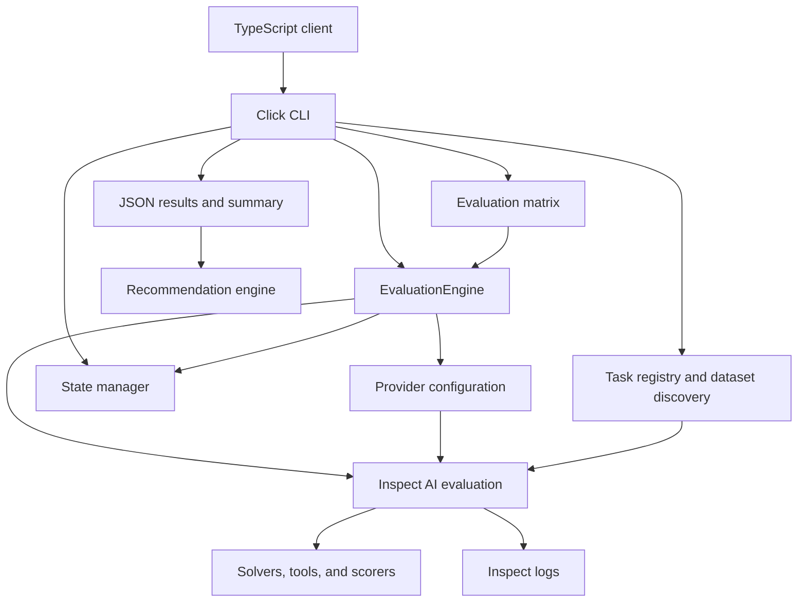

# Architecture Overview

matric-eval is a Python evaluation CLI built on Inspect AI. It assembles benchmark tasks, selects inference providers, persists benchmark results, and produces summaries and model recommendations. This document describes the checked-in implementation; the [decision records](decisions/) also contain historical designs and planned integrations.

## Components and execution flow



| Component | Source | Responsibility |
|-----------|--------|----------------|
| CLI | [`cli.py`](../../src/matric_eval/cli.py) | Click commands, model selection, run/resume orchestration, output, validation, and study command entry points |
| Evaluation engine | [`core/engine.py`](../../src/matric_eval/core/engine.py) | Load tasks, call synchronous `inspect_ai.eval()`, collect metrics, and reuse completed benchmark checkpoints |
| Providers | [`providers/`](../../src/matric_eval/providers/) | Discover models, check availability, format Inspect model identifiers, and supply endpoint/authentication settings |
| Task registry | [`tasks/registry.py`](../../src/matric_eval/tasks/registry.py) | Register task factories and benchmark metadata, tier sample counts, lifecycle status, and execution prerequisites |
| Dataset handling | [`datasets.py`](../../src/matric_eval/datasets.py), [`discovery.py`](../../src/matric_eval/discovery.py) | Load benchmark data and discover external JSONL datasets |
| Scoring | [`scorers/`](../../src/matric_eval/scorers/), [`judges/`](../../src/matric_eval/judges/) | Deterministic scoring, code execution, retrieval/project scoring, and optional model judging |
| Persistence | [`state/manager.py`](../../src/matric_eval/state/manager.py) | Run metadata, atomic checkpoint writes, model progress, gap detection, and locking |
| Recommendations | [`recommendation.py`](../../src/matric_eval/recommendation.py) | Aggregate capability scores, apply model constraints, and export recommendations |
| Studies | [`studies/`](../../src/matric_eval/studies/) | Validate protocols, qualify model artifacts, execute offline batches, score outputs, and analyze paired observations |

The normal `run` path resolves models, thinking modes, and benchmark selection before initializing state. Each evaluation target runs its benchmark tasks through the engine. Task factories choose datasets, solvers, and scorers; registered entries can be unavailable or gated, so registry presence alone does not prove that a benchmark is runnable. `list-benchmarks` and `audit-benchmarks` expose this distinction.

The engine records framework and benchmark provenance. For its scalar benchmark score, it selects the first scorer's `accuracy` metric when available, then falls back to that scorer's first metric. Inspect logs retain the richer evaluation record. Recommendations are a separate `recommend` operation; normal evaluation does not automatically run additional custom tests on winners.

## Providers and model identity

[`Provider`](../../src/matric_eval/providers/base.py) is a runtime-checkable protocol with availability, model listing/inspection, model ID formatting, and evaluation keyword methods. The registry supplies Ollama, vLLM, llama.cpp, OpenRouter, and Chutes implementations.

Ollama uses Inspect's `ollama/` identifiers. The other built-in providers use OpenAI-compatible `openai/` identifiers plus provider-specific endpoints and credentials. When no provider object is passed to `EvaluationEngine`, the supplied model string is retained as-is. Provider configuration controls inference routing; it does not establish an execution sandbox for generated code.

[`models/spec.py`](../../src/matric_eval/models/spec.py) defines qualified model specifications, including checkpoint identity, lineage, quantization, runtime, and sampling controls. [`providers/matrix.py`](../../src/matric_eval/providers/matrix.py) expands YAML matrices into Cartesian combinations or explicit runs, with exclusions. Schema 2 uses qualified specifications and validates cohort relationships. The CLI passes runtime sampling and reasoning settings to evaluation and preserves model specifications in matrix results.

Matrix execution has its own sequential CLI loop and writes a summary. It does not initialize the normal `StateManager`; `--matrix` and `--resume` are mutually exclusive. Do not assume normal-run checkpoint recovery applies to matrix runs.

## Checkpoint and output model

The normal CLI run uses benchmark-level checkpoints. A successfully completed benchmark is reused on resume; an unfinished or failed benchmark is rerun. This is not per-problem recovery, even though the state models contain problem-related fields.

```text
results/run-<timestamp>/
├── meta.json                 # Run configuration and benchmark checkpoint granularity
├── state.json                # Run progress and status
├── lock                      # Exclusive run lock while active
├── <model-state-directory>/
│   └── state.json            # Benchmark status and serialized benchmark results
├── <target-result>.json      # Per-target aggregate result
├── summary.json              # Run aggregate
└── logs/                     # Inspect logs in model/thinking-mode directories
```

The exact model and target paths are normalized by the state manager and CLI. Metadata records the selected provider, models/targets, and execution configuration used to reconstruct a resumed run. State writes use a temporary file followed by replacement. Lock acquisition uses exclusive file creation; stale locks require explicit operator handling. These mechanisms do not guarantee recovery from every storage or process failure.

[`state/recovery.py`](../../src/matric_eval/state/recovery.py) also provides error classification and retry-policy helpers. Their existence should not be interpreted as an automatic retry loop around every engine call: the engine converts evaluation exceptions into error results, and normal checkpoint handling preserves failures for later resume.

The normal CLI target loop is sequential. [`parallel.py`](../../src/matric_eval/parallel.py) provides reusable parallel execution utilities, but is not wired into that loop. Benchmark sample execution is delegated to Inspect. There is no distributed scheduler or database-backed coordination service in this implementation.

## Study execution and analysis

Study workflows are separate from ordinary tiered runs:

1. [`studies/protocol.py`](../../src/matric_eval/studies/protocol.py) validates study configuration and builds manifests with benchmark allocations and model specifications.
2. [`studies/batch.py`](../../src/matric_eval/studies/batch.py) validates request contracts and model artifacts, checks runtime conditions and GPU lease information, and executes offline batches.
3. [`studies/server_cli.py`](../../src/matric_eval/studies/server_cli.py) manages an attested serving process and records runtime artifacts.
4. [`studies/scoring.py`](../../src/matric_eval/studies/scoring.py) scores saved outputs, including benchmark-specific IFEval, MMLU, and LiveCodeBench paths.
5. [`studies/analysis.py`](../../src/matric_eval/studies/analysis.py) computes model and paired summaries, bootstrap confidence intervals, McNemar tests, and Holm-adjusted comparisons.

These paths have protocol and runtime prerequisites beyond a normal `run`. Their command wrappers are in the same `studies/` package; see the [CLI reference](../cli.md) for the supported command surface.

## Language integration and packaging

[`pyproject.toml`](../../pyproject.toml) defines Python 3.11+, the `matric-eval` console entry point, Click/Rich presentation, Pydantic configuration/state models, and pinned Inspect AI/Inspect Evals dependencies. Optional dependency groups support studies, DS-1000, EvalPlus, and development checks.

The implemented TypeScript package is [`@matric/eval-client`](../../bindings/typescript/package.json). Its [`MatricEvalClient`](../../bindings/typescript/src/client.ts) spawns the Python CLI, parses JSON, exposes output callbacks, and supports cancellation with `AbortSignal`/`SIGTERM`. Python remains a separately installed runtime dependency. The repository contains no Rust binding implementation; [ADR-001](decisions/ADR-001-python-core-with-bindings.md) describes the integration intent rather than an available crate. Package source and build metadata alone do not establish that a release is published to a registry.

## Execution boundaries

The local CLI can contact inference endpoints and external dataset services. Prompts, responses, endpoint settings, and result artifacts can contain sensitive material; their handling depends on the selected provider and task.

The default [`code_execution.py`](../../src/matric_eval/scorers/code_execution.py) scorer runs generated Python in a local subprocess using the current interpreter, with a timeout and captured output. It does **not** impose filesystem/network isolation or a memory limit. Ollama does not sandbox this execution. Run such evaluations only in an environment appropriate for executing untrusted generated code.

[`sandbox/`](../../src/matric_eval/sandbox/) provides a separate agentic-sandbox service client, context management, runners, and tools for tasks that explicitly use them. Its configuration includes network mode and resource allocations, but those settings do not automatically wrap every scorer. Upstream tasks and study-specific Docker execution can have their own isolation requirements; assess the actual selected task path.

## Further reading

- [README](../../README.md)
- [CLI reference](../cli.md)
- [ADR-002: Inspect AI](decisions/ADR-002-inspect-ai-framework.md)
- [ADR-003: JSONL test format](decisions/ADR-003-jsonl-test-format.md)
- [ADR-004: tiered evaluation](decisions/ADR-004-tiered-evaluation.md)
- [ADR-005: checkpoint/resume design](decisions/ADR-005-checkpoint-resume-design.md)
