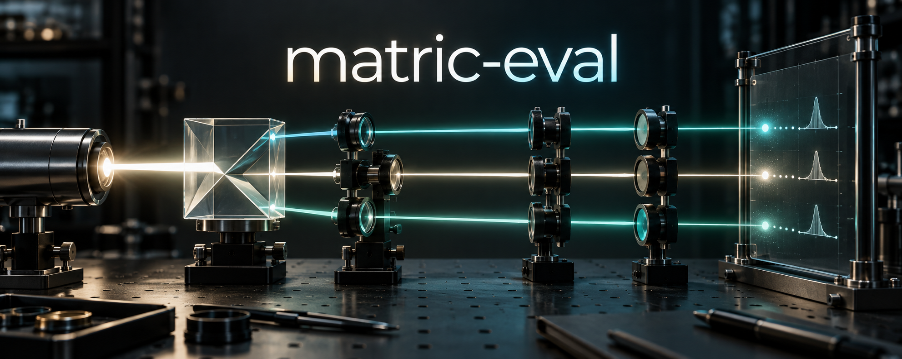
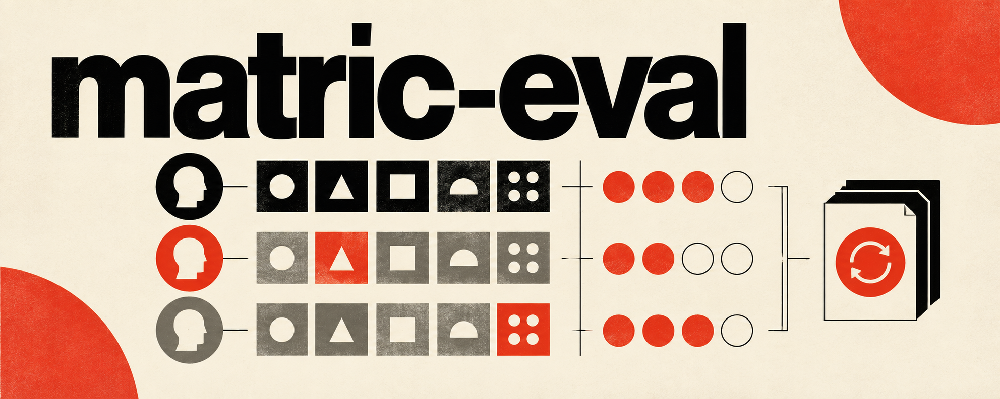
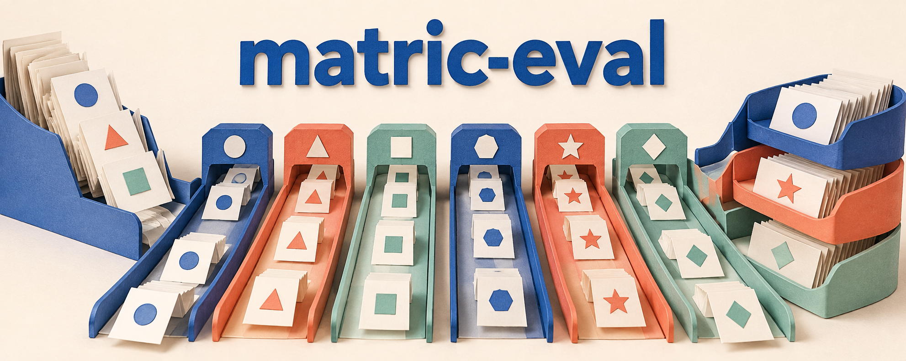
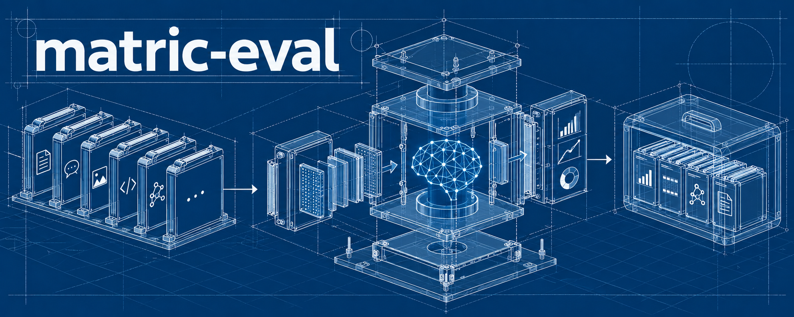
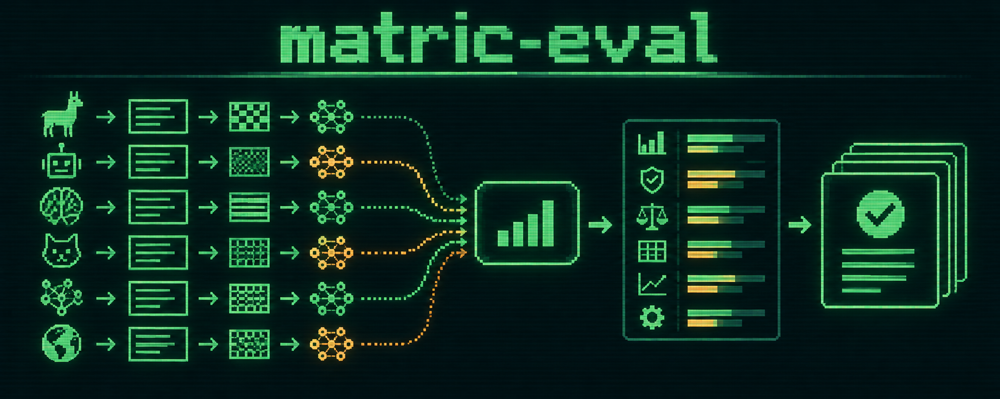
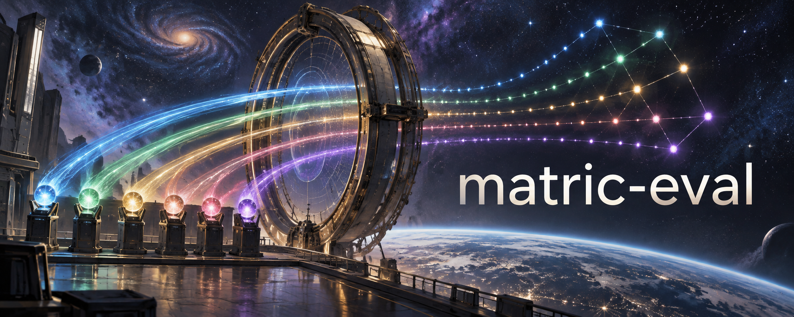

# README hero options

Six independent image generations for matric-eval. Each uses a different visual medium and composition,
with the project name as its only text. The imagery is conceptual; charts and apparatus are decorative,
not measured results or a depiction of the software interface.

Generated with the built-in image generation tool. Original PNGs are retained here at 1983 × 793 pixels.
The exact six prompts are in [prompts.json](prompts.json).

Retro terminal is the selected README hero. To choose another, replace the image `src` and its
matching `alt` text at the top of [the project README](../../../README.md). Use the corresponding filename
below; each image can be used directly without cropping.

## 01 — Precision instrument

Cinematic laboratory photography: parallel optical paths and a calibrated measurement plane.

## 02 — Swiss editorial

Flat ivory, black, and vermilion print design with bold typography and a geometric comparison matrix.

## 03 — Paper sculpture

Tactile cut-paper testing lanes and result trays, with a warm background and soft studio shadows.

## 04 — Engineering blueprint

Fine technical drafting on Prussian blue, showing samples, an evaluation apparatus, and retained outputs.

## 05 — Retro terminal (selected)

Green and amber pixel art with scanline texture, parallel processing tracks, and organized outputs.

## 06 — Orbital observatory

Expansive science-fiction observatory with luminous trajectories resolving into an ordered constellation.

